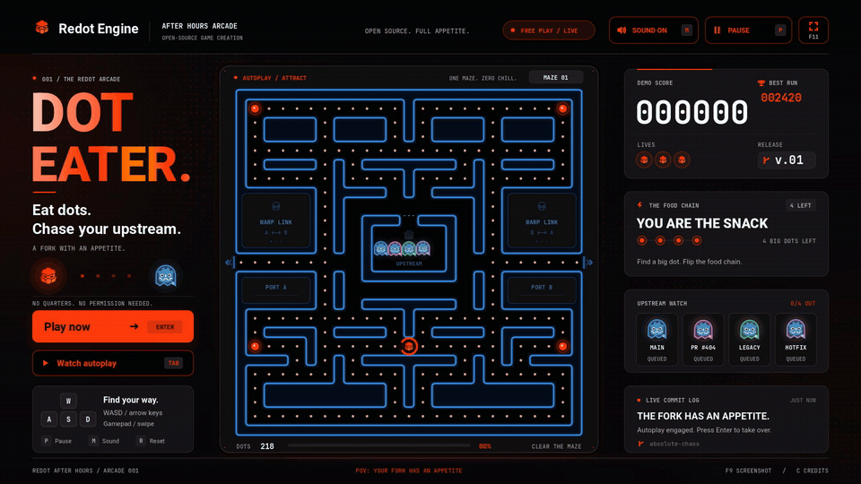

# DOT EATER

**Eat dots. Chase your upstream.**

A native Redot/Godot arcade maze game built for deeply unserious marketing.
Play as **Redion**, the Redot mascot, dodge the Godot-logo upstream ghosts,
and grab a power dot to turn your upstream into a snack.

**Made with Redot · Website-matched UI · Keyboard, gamepad & touch**

## Gameplay video

[](marketing/dot-eater-x.mp4)

**[▶ Watch the full gameplay video with audio](marketing/dot-eater-x.mp4)**
— **2560 × 1440 · 60 FPS · 20 seconds**

The animated preview above is made from the actual recorded run. Click it or the
video link for the full-resolution MP4 with the original chip music and arcade
sound effects.

### The fork has an appetite

- **Classic maze rules:** 218 dots, single-width looping lanes, warp tunnels,
  three lives, and four ghost personalities.
- **Flip the food chain:** a power dot turns the blue maze Redot red and lets
  Redion eat upstream ghosts for escalating **200 / 400 / 800 / 1600** combos.
- **Redot after hours:** the website's orange-red palette, Roboto headings,
  warm text gradients, graphite cards, and pixel-blast background.
- **Ready for a clip:** real AI-driven autoplay, bonus forks, cheeky commit-log
  messages, and native 1440p capture.

## Play

Open `project.godot` in **Redot 26.2** and press **F6/F5**, or run:

```sh
./launch.sh
```

The launcher works from any directory and forwards engine arguments, such as
`./launch.sh --fullscreen`. If needed, set `REDOT_BIN` to your Redot executable.

The title screen is a live autoplay attract mode. Click **PLAY NOW** or press
**Enter** to start your own three-life run. The project uses Godot 4-compatible
GDScript and the Compatibility renderer.

| Control | Action |
| --- | --- |
| Arrow keys / WASD | Move; turns are buffered, reversals are instant |
| Enter / Space | Start from the attract screen or game over |
| P / Esc / Space | Pause or resume during a run |
| R | Restart |
| Tab | Restart the autoplay demo |
| M | Mute/unmute music and effects |
| F11 | Toggle fullscreen |
| F9 | Save a clean screenshot to the engine's user-data directory |
| C | Credits |
| Gamepad | Left stick / D-pad to move, A to start, Start to pause |
| Mouse / touch | Click the buttons; swipe on the maze to steer |

### Rules

- Small dots: **10** points. Big power dots: **50** points and **8 seconds** of
  upstream panic.
- Eat frightened ghosts for **200 / 400 / 800 / 1600** points per combo.
- One-tile-wide lanes form connected loops with no dead ends. The side tunnels
  wrap between the labeled warp ports. Ghosts return to their house after being eaten.
- A bonus **fork** appears after 65 dots: collect it for **500** points.
- Clear every dot for **1000** bonus points and a faster next release.
- Three lives per run. Personal best and sound preferences persist locally.
- Four ghost personalities: direct pursuit, ambush, flanking, and shy pursuit.

## Web export and Railway

**[Play DOT EATER in your browser](https://web-production-72c7.up.railway.app/)**

Install the **Redot 26.2 export templates**, then build the browser version:

```sh
bash export-web.sh
```

Set `REDOT_BIN` if your engine executable has a different path. The `Web`
preset uses the Compatibility renderer and a single-threaded WebAssembly
runtime. The generated `build/web/` bundle contains the game and an nginx
container configured for Railway's `PORT`, compression, and `/healthz` check.

With the Railway CLI logged in and linked to the game's project:

```sh
railway up build/web --path-as-root --no-gitignore --service web --environment production
railway domain --service web --port 8080
```

Re-run the export and upload commands after game changes. Generated files are
ignored by Git; `--no-gitignore` includes them in this bundle-only upload.
Click **PLAY NOW** or press **Enter** to play. Browsers may require a click or
keypress before allowing audio; score and mute preferences stay in browser storage.

The web renderer uses baked maze/background art in `assets/web/` to avoid
rebuilding static neon geometry each frame. After changing maze geometry or
its visual style, regenerate that art with a graphics display before exporting:

```sh
redot --path . -s tools/bake_web_art.gd
```

Audio pause updates are transition-only: repeatedly assigning `stream_paused`
can restart and copy music buffers in the web sample backend.

## Make an X clip

Ready-made files are in `marketing/`: 1440p gameplay stills and a **20-second,
2560 × 1440, 60 FPS MP4** with arcade audio.

- [Full gameplay video with audio](marketing/dot-eater-x.mp4)
- [Animated README preview](marketing/dot-eater-demo.gif)
- [Blue-maze screenshot](marketing/dot-eater-preview.png)
- [Red power-mode screenshot](marketing/dot-eater-power.png)

The UI is composed at **1600 × 900 (16:9)** and rendered natively at **2560 × 1440**
for capture. Movie Maker uses a `movie` feature override for that window size.
Attract mode plays the real game
with an AI pilot, including power dots, ghost combos, and the live commit log.
Press **Tab** for a fresh demo, **F11** for fullscreen, and record it with OBS,
or use the engine's built-in Movie Maker:

```sh
redot --path . --resolution 2560x1440 --fixed-fps 60 \
  --write-movie /tmp/dot-eater.avi --quit-after 1200 -- --demo

ffmpeg -i /tmp/dot-eater.avi \
  -vf "scale=in_color_matrix=bt601:out_color_matrix=bt709:in_range=full:out_range=limited,format=yuv420p" \
  -c:v libx264 -crf 18 -color_range tv -colorspace bt709 \
  -color_primaries bt709 -color_trc bt709 \
  -af "loudnorm=I=-16:TP=-1.5:LRA=11" -ar 48000 \
  -c:a aac -b:a 160k -movflags +faststart /tmp/dot-eater.mp4
```

That produces a **20-second** clip with the original synthesized arcade audio.
Give Movie Maker a normal graphics/display session. The output parent directory
must exist. Quit normally so the movie's header is finalized.

For a reproducible clean still:

```sh
redot --path . --fixed-fps 60 -- \
  --demo --1440p --capture=/tmp/dot-eater.png --capture-frame=480
```

`./launch.sh -- --1440p` also opens a 2560 × 1440 window for normal play.

## Website-matched UI

The interface follows https://www.redotengine.org/: near-black ink, graphite
cards, the exact `#FF3B0A` primary accent, Roboto typography, warm gradient
headings, orange-outline controls, and a subtle pixel-blast backdrop.
Shared palette tokens live in `scripts/redot_style.gd`. The supplied Redot logo
assets retain their original colors and proportions.

The maze uses classic blue walls during normal play, switches to Redot red while
a power dot is active, and returns to blue as soon as the power timer runs out.
Warp-port panels, the ghost-house gate, and tunnel indicators follow the same state.

Caption material:

> pov: your fork has an appetite
>
> upstream is now a downstream snack. 🟠
>
> we heard you like dots so we re-dotted your dots

## Assets

The **entire supplied brand kit** is copied into `assets/redot_brand/`, including
the PDF guidelines, all logo variants, and original font archives. A `.gdignore`
keeps unused high-resolution variants out of the import pipeline. The in-game
SVGs and fonts are copied into `assets/branding/` and `assets/fonts/`.

Godot ghost icons come from the official press kit. Original logo proportions
are preserved. Attribution is included in `assets/ATTRIBUTION.md`, the original
notices, and the in-game credits.

## Project layout

- `scenes/arcade.tscn` — the launch scene.
- `scripts/arcade_maze.gd` — maze data, pickups, tunnels, and routes.
- `scripts/maze_runner.gd` — continuous, tile-centered movement.
- `scripts/game_session.gd` — rules, ghost personalities, and autoplay.
- `scripts/arcade_view.gd` — custom-drawn cabinet UI, controls, and effects.
- `scripts/arcade_icons.gd` — crisp, shared vector icons for the arcade HUD.
- `scripts/redot_style.gd` — shared Redot website palette and shader resources.
- `shaders/` — native pixel-blast background and warm gradient headline.
- `scripts/arcade_audio.gd` — original procedural chip music and sound effects.

## Verify

```sh
redot --headless --path . --import
redot --headless --path . -s tests/gameplay_test.gd
redot --headless --path . -s tests/input_test.gd
```

The behavioral checks reject open 2×2 lane sections and dead ends, and cover
reachable pellets, buffered turning, smooth
reversals, tunnel wrapping, power-dot combos, lives, pause, level progression,
and a 45-second autoplay soak. The native input checks exercise the launch scene
through Godot's input system using keyboard, mouse, and touch events, including
start, steering, pause, mute, credits, autoplay, and restart. On a graphical
display they also verify the fullscreen button and F11. Touch-generated mouse
events are filtered so a tap never toggles a button twice.
